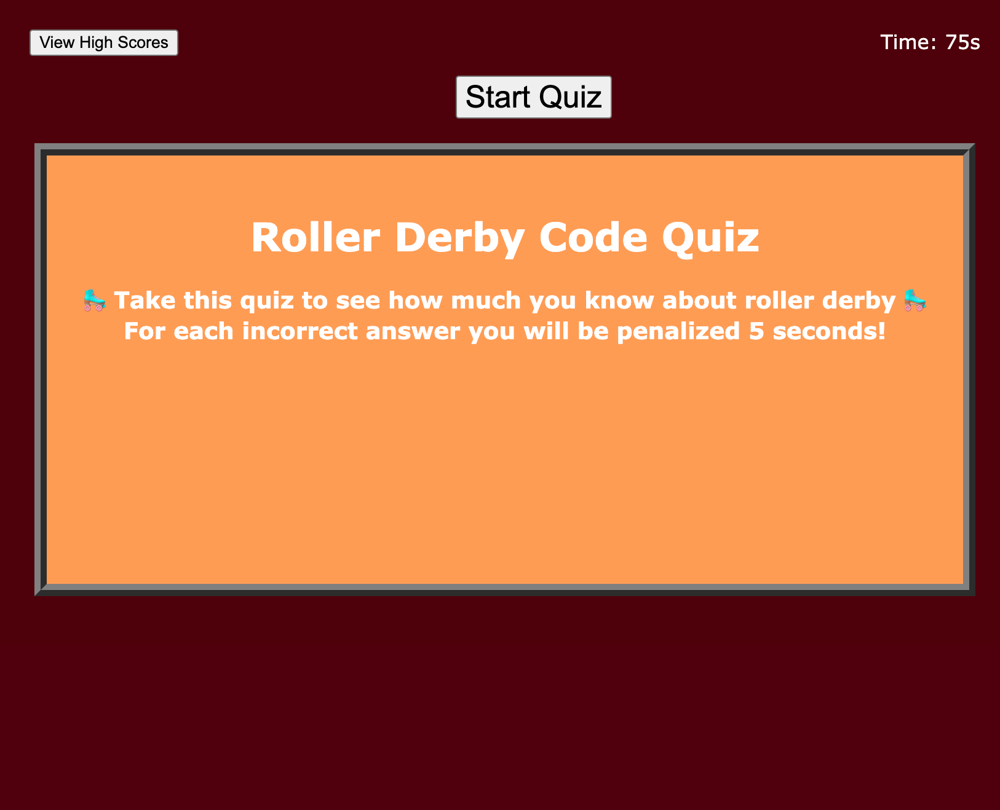

# golebiewski-code-quiz

# Challenge 2 - Portfolio

By Dana Golebiewski

## Description 
For this challenge, I created a code quiz with a timer. For each incorrect answer, 5 seconds will be deducted. You can view the high score, clear the high score, and be taken to the high scores page from a button. 

## Built With 
HTML, CSS, JavaScript

## Link to final version 

[Site Link] (https://danagolebiewski.github.io/golebiewski-code-quiz/)

## Website Preview

